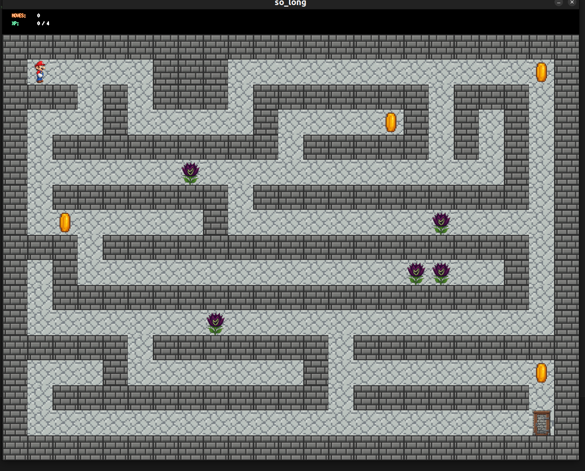
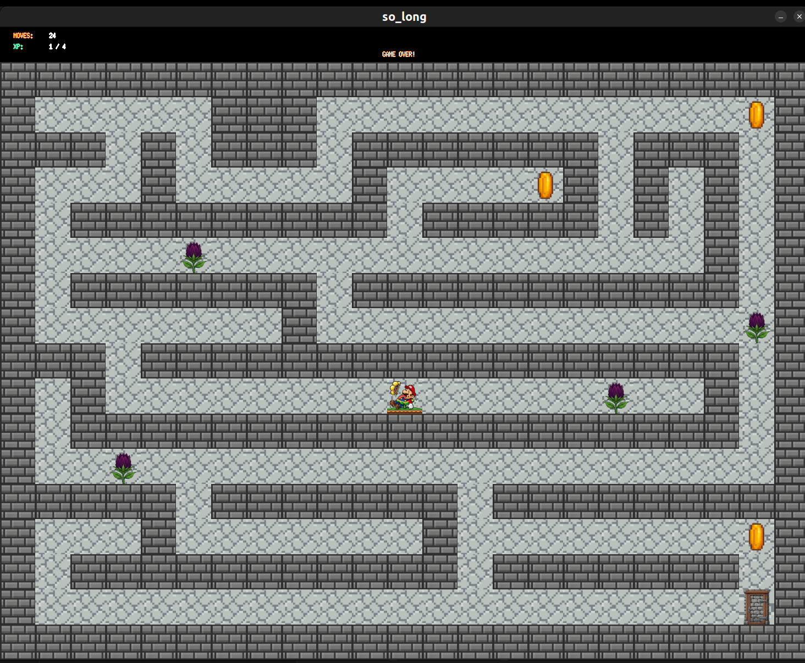

# So Long - A 2D Game Project

## Description

**So Long** is a basic 2D game developed as part of a computer graphics project. The game involves a player (represented by a dolphin or any character of your choice) who must collect all the fish (or collectibles) on the map and escape through the exit. The project focuses on working with textures, sprites, and basic gameplay elements using the MiniLibX library.



## Features

- **Window Management**: Opens a window to display the game and handles events like closing the window or pressing the ESC key.
- **Player Movement**: The player can move in four directions (up, down, left, right) using the W, A, S, D keys or arrow keys.
- **Map Parsing**: The game reads a map file with the `.ber` extension, validates it, and ensures it meets specific criteria (e.g., enclosed by walls, contains one exit, one player start, and at least one collectible).
- **Graphics**: Uses MiniLibX for rendering images and textures.
- **Movement Counter**: Displays the number of moves in the shell or on the screen (bonus).

## Requirements

- **Language**: C
- **Library**: MiniLibX (provided by the school or installed from sources)
- **Compiler**: GCC with flags `-Wall -Wextra -Werror`
- **Makefile**: Must include rules for `all`, `clean`, `fclean`, and `re`

## Installation

Clone the repository:

```bash
git clone https://github.com/husaltam/so_long_2D_Game.git so_long
cd so_long
```

Compile the project:

```bash
make re
make bonus
```

## Usage

Run the game with a valid `.ber` map file as an argument:

```bash
./so_long_bonus assets/maps_bonus/Chamber_of_Patrols.ber
```

## Controls

- **W / Arrow Up**: Move up  
- **A / Arrow Left**: Move left  
- **S / Arrow Down**: Move down  
- **D / Arrow Right**: Move right  
- **ESC**: Quit the game  
- **Close Window (X)**: Quit the game

## Map Rules

The map must adhere to the following rules:

- Composed of characters:  
  - `0` = empty space  
  - `1` = wall  
  - `C` = collectible  
  - `E` = exit  
  - `P` = player start
- Must be rectangular and enclosed by walls.
- Must contain **exactly one exit (E)**, **one player start (P)**, and **at least one collectible (C)**.
- Must have a valid path for the player to collect all items and reach the exit.

### Example of a valid map

```
1111111111111
10010000000C1
1000011111001
1P0011E000001
1111111111111
```

## Bonus Features

- **Enemies**: Player loses if they touch an enemy patrol.
- **Sprite Animation**: Animated sprites for characters or collectibles.
- **On-Screen Movement Counter**: Displays the move count directly on the game window.


# ⚠️ **Play and win the game — but beware!**  
## Never step on the deadly flowers, or you shall perish! 💀🌸



